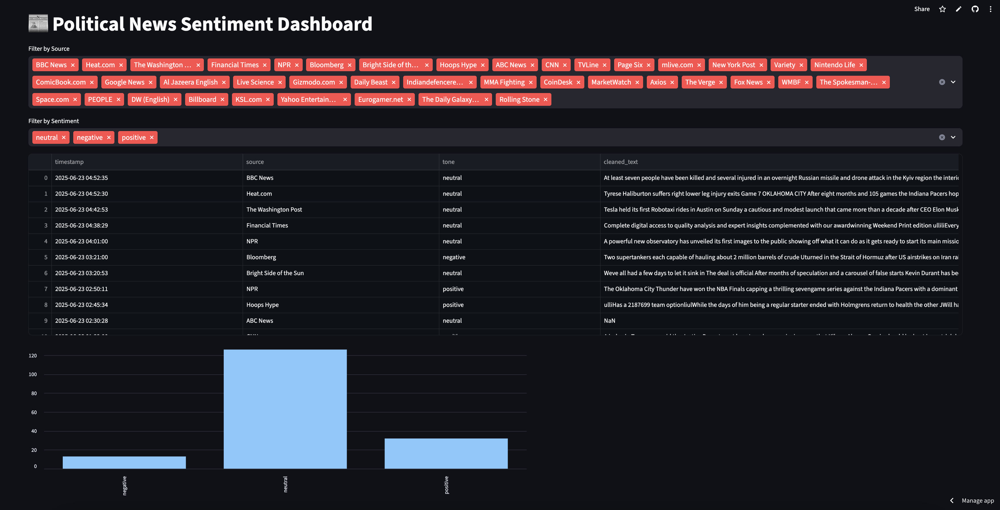

# 📰 Real-Time News Sentiment Dashboard

A fully automated, containerized pipeline that fetches political news daily, analyzes article sentiment using a custom-trained ML model, stores results in Amazon RDS, and visualizes trends through an interactive Streamlit dashboard.

🔗 **Live App**: [https://dailynewssentimentapp.streamlit.app](https://dailynewssentimentapp.streamlit.app)

---

## 🚀 Features

- 🔄 Automated ETL pipeline using GitHub Actions (daily trigger)
- 🤖 Custom Voting Classifier (LogReg/SVM/RF) trained on 30K+ TF-IDF samples
- ☁️ Model hosted on AWS S3 and dynamically loaded at runtime
- 🗃 PostgreSQL storage via Amazon RDS with SQLAlchemy ORM
- 📊 Live Streamlit dashboard with Altair charts and auto-refresh
- 🐳 Fully Dockerized for portable, reproducible builds

---

## 🧱 Tech Stack

**Languages & Libraries:** Python, Pandas, scikit-learn, TF-IDF, SQLAlchemy  
**Dashboard:** Streamlit, Altair  
**Infra:** Amazon RDS (PostgreSQL), AWS S3, Docker, GitHub Actions  
**Data Source:** NewsAPI

---

## 📂 Key Files and Directories

- `app.py` — Streamlit dashboard
- `pipeline.py` — Main ETL runner
- `update_script/` — Scripts for news fetching, cleaning, inference, and DB writing
- `db/` — SQLAlchemy table schema and connection setup
- `Dockerfile` — Defines container image
- `.env` — Stores environment variables (for local run)
- `.streamlit/` — Runtime and secrets config for Streamlit Cloud

---

## 🐳 Docker Setup

### Build and run locally:
```bash
docker build -t news-dashboard .
docker run -p 8501:8501 --env-file .env news-dashboard
```

### `.env` file format:
```
NEWS_API_KEY=your_key
DB_USER=your_user
DB_PASSWORD=your_pw
DB_HOST=your-db-host.rds.amazonaws.com
DB_PORT=5432
DB_NAME=news_sentiment
```

---

## 🤖 GitHub Actions Automation

- Runs `pipeline.py` daily at 6AM UTC
- Automates the full workflow: fetch → clean → predict → store
- Uses encrypted GitHub Actions secrets for API keys and DB credentials

---

## 📊 Dashboard Preview


---

## 📬 Contact

Built with ❤️ by Minh Bui
📨 [LinkedIn](https://www.linkedin.com/in/minhlebui/) • [GitHub](https://github.com/M1nhbui)
